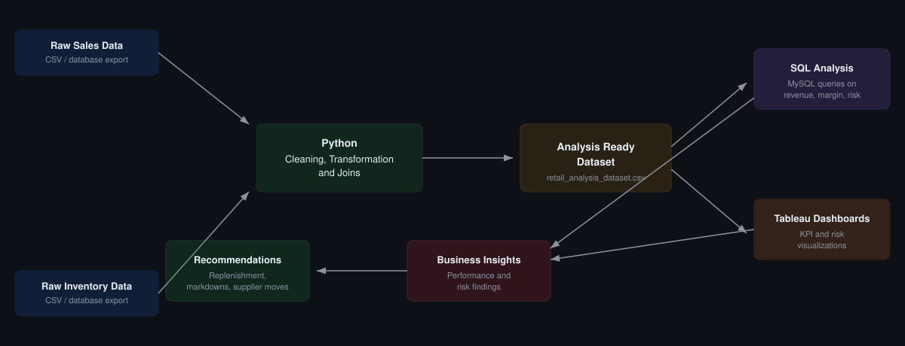
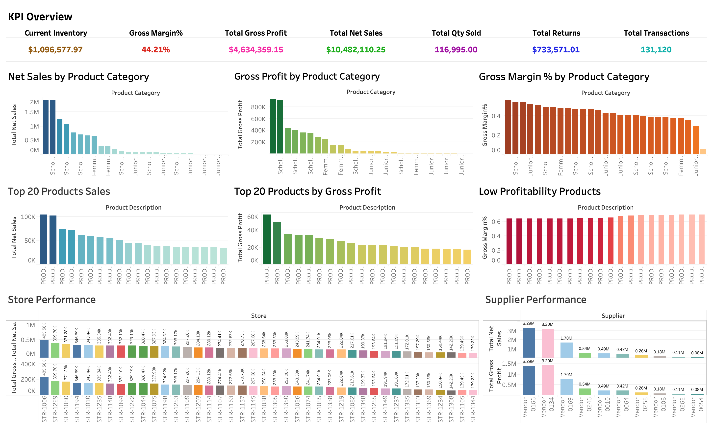
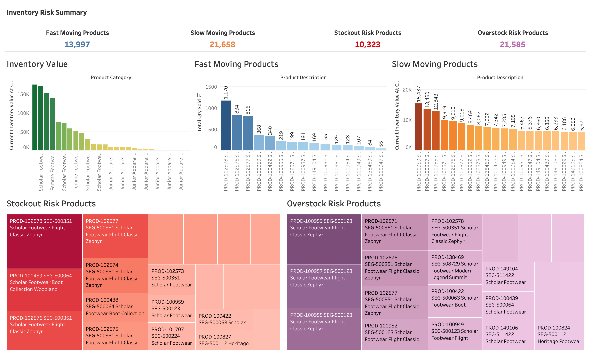

<div align="center">

# 📊 Retail Sales Performance & Inventory Risk Analysis

### End-to-End Retail Analytics Project | Python · SQL · Tableau

*Transforming raw retail sales and inventory data into actionable insights for revenue performance, profitability, supplier management, and inventory risk.*

[](#)
[](#)
[](#)
[](#)
[](LICENSE)

[Project Overview](#-project-overview) •
[Dashboards](#-dashboard-preview) •
[Key Insights](#-key-business-insights) •
[How to Run](#how-to-run-this-project) •
[Presentation](#-presentation)

</div>

---

## 📌 Project Overview

This project delivers an **end-to-end retail analytics pipeline** — from raw, messy sales and inventory data to a fully interactive Tableau dashboard suite — designed to answer the questions retail and merchandising teams care about most: *What's selling, what's profitable, what's at risk, and what should we do next?*

The workflow spans the full analytics stack:

| Stage | What Happens |
|---|---|
| 🧹 **Data Preparation** | Clean, standardize, and join raw sales + inventory data in Python |
| 🗄️ **SQL Analysis** | Query revenue, margin, supplier, and inventory metrics in MySQL |
| 📊 **Dashboarding** | Visualize KPIs and risk signals in interactive Tableau dashboards |
| 📑 **Storytelling** | Translate findings into business insights and recommendations |

> 💡 **Why this project matters:** Most portfolio projects stop at "here's a chart." This one closes the loop — every dashboard ties back to a specific business decision (replenishment, markdown, supplier renegotiation) and every recommendation is backed by a number.

---

## 🎯 Business Objectives

This analysis was built to answer the questions a retail analytics or category management team would actually ask:

- 💰 Which **products, categories, stores, and suppliers** drive the most revenue and gross profit?
- 📈 Which product groups have **stronger or weaker margins**, and why?
- 📦 Which products are **fast-moving, slow-moving, at risk of stockout, or overstocked**?
- 🔁 How can **inventory and replenishment decisions** improve commercial performance and free up working capital?

---

## 🛠️ Tools & Technologies

<div align="center">

| Layer | Tools |
|---|---|
| **Data Wrangling** | Python, Pandas, NumPy, Jupyter Notebook |
| **Analysis** | SQL, MySQL |
| **Visualization** | Tableau |
| **Version Control** | Git, GitHub |

</div>

---

## 📂 Repository Structure

```text
retail-sales-inventory-analysis
│
├── data
│   └── retail_analysis_dataset.csv
│
├── images
│   ├── business_performance.png
│   └── inventory_risk_analysis.png
│
├── notebooks
│   └── retail_&_inventory.ipynb
│
├── presentations
│   └── retail_sales_inventory_analysis_presentation.pdf
│
├── sql
│   └── retail_inventory_analysis.sql
│
├── tableau
│   └── retail_analysis_dashboard.twb
│
├── README.md
├── LICENSE
└── requirements.txt
```

> 📁 **Note on data files:** The original raw sales/inventory files and intermediate cleaned files are **not included** — they exceed GitHub's upload size limit. This repo includes the final analysis-ready dataset (`data/retail_analysis_dataset.csv`). The full cleaning, transformation, and join logic is documented step-by-step in the notebook.

---
## 🔄 Project Workflow

<p align="center">
  
</p>
---

### 1️⃣ Data Preparation — *Python*
- Cleaned and standardized retail sales and inventory datasets
- Engineered calculated metrics and business KPIs (gross margin, turnover, risk flags)
- Joined datasets into a single analysis-ready table
- Exported the final dataset for SQL and Tableau

### 2️⃣ SQL Analysis — *MySQL*
Queried the dataset to evaluate:
- Revenue performance
- Gross profit and gross margin
- Product category performance
- Store-level performance
- Supplier contribution
- Inventory movement and risk classification

### 3️⃣ Dashboard Design — *Tableau*
Built interactive dashboards covering:
- KPI summaries
- Product and category performance
- Supplier and store performance
- Inventory risk indicators
- Fast-moving vs. slow-moving products
- Stockout and overstock risk analysis

---

## 📊 Dashboard Preview

### 🏆 Business Performance Dashboard
Overall sales, profit, and inventory health at a glance — revenue and gross profit trends, product/category performance, supplier contribution, and store-level performance to spot what's driving growth.

<p align="center">
  
</p>

### ⚠️ Inventory Risk Analysis Dashboard
A focused view of inventory health — fast-moving and slow-moving products, stockout-risk items, and overstocked inventory to support smarter replenishment and reduce carrying costs.

<p align="center">
  
</p>

> 🖱️ **Want to explore interactively?** Open `tableau/retail_analysis_dashboard.twb` in Tableau Desktop (or Tableau Public) to filter by category, store, and supplier yourself.

---

## 📈 Key KPIs

<div align="center">

| Metric | Value |
|---|---|
| 💵 Total Net Sales | **$10,482,110.25** |
| 📈 Total Gross Profit | **$4,634,359.15** |
| 📊 Gross Margin | **44.21%** |
| 📦 Current Inventory at Cost | **$1,096,577.97** |
| 🔢 Total Quantity Sold | **116,995** |
| ↩️ Total Returns | **$733,571.01** |
| 🧾 Total Transactions | **131,120** |
| 🟢 Fast-Moving Products | **13,997** |
| 🟡 Slow-Moving Products | **21,658** |
| 🔴 Stockout-Risk Products | **10,323** |
| 🔵 Overstock-Risk Products | **21,585** |

</div>

---

## 💡 Key Business Insights

- 💰 The business generated **$10.48M in net sales** and **$4.63M in gross profit**, landing a healthy **44.21% gross margin**.
- 🏷️ Product and category performance analysis pinpointed the strongest revenue and profit contributors — clear candidates for deeper commercial investment.
- ↩️ Returns totaled **$733.57K (~7% of net sales)** — worth investigating for product quality, customer behavior, or fulfillment issues.
- 📦 Current inventory at cost sits at **$1.10M**, underscoring the balance needed between availability and carrying cost.
- ⚖️ Inventory risk analysis surfaced a real tension: **stockout-risk products** that threaten lost sales, alongside **slow-moving/overstocked products** that tie up working capital.
- 🚚 Supplier performance analysis flagged the need to actively monitor contribution and concentration to protect supply chain resilience.

---

## ✅ Business Recommendations

1. **Prioritize replenishment** for high-demand, stockout-risk products to avoid lost sales.
2. **Review slow-moving and overstocked inventory** to cut carrying costs and improve turnover.
3. **Investigate high-return products** for potential quality, pricing, or fulfillment issues.
4. **Monitor supplier concentration** to reduce dependency risk and strengthen procurement leverage.
5. **Evaluate low-margin products** before scaling promotions, to protect overall profitability.
6. **Stand up ongoing KPI monitoring** for sales, profitability, returns, and inventory health.

---

## 🎤 Presentation

📑 [View the full project presentation (PDF)](presentations/retail_sales_inventory_analysis_presentation.pdf)

---

## ⚙️ Installation & Requirements

```bash
pip install -r requirements.txt
```

**Requirements:** Python 3.9+, MySQL 8.0+, Tableau Desktop / Tableau Public (to open `.twb` files)

---

## ▶️ How to Run This Project

**1. Clone the repository**
```bash
git clone https://github.com/aditya-pandey-data/retail-sales-inventory-analysis.git
cd retail-sales-inventory-analysis
```

**2. Install dependencies**
```bash
pip install -r requirements.txt
```

**3. Run the data preparation notebook**
```bash
jupyter notebook notebooks/retail_&_inventory.ipynb
```

**4. Run the SQL analysis**
```text
sql/retail_inventory_analysis.sql
```

**5. Open the Tableau dashboard**
```text
tableau/retail_analysis_dashboard.twb
```

---
## 🧠 Skills Demonstrated

- 🧹 Data Cleaning & Transformation
- 🔍 Exploratory Data Analysis (EDA)
- 🗄️ SQL Business Analysis
- 📊 KPI Development
- 📈 Tableau Dashboard Design
- 📦 Inventory Risk Analysis
- 💬 Business Insight Communication
- 🎨 Data Visualization & Storytelling

---

## 🤝 Connect

If you found this project useful or have feedback, feel free to open an issue, fork the repo, or connect with me.

<div align="center">

[](https://github.com/aditya-pandey-data)

</div>

---

## 📜 License

This project is licensed under the terms of the [MIT License](LICENSE).

